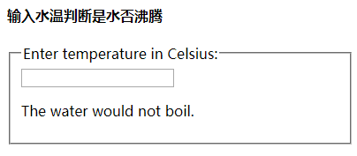

## 状态提升(Lifting State Up)

什么叫状态提升：在 React 中，共享 state(状态) 是通过将其移动到需要它的组件的最接近的共同祖先组件来实现的。 这被称为“状态提升(Lifting State Up)”

使用 react 经常会遇到几个组件需要共用状态数据的情况。这种情况下，我们最好将这部分共享的状态提升至他们最近的父组件当中进行管理。

案例1：温度计算器来计算水是否会在给定的温度下烧开

 

    // 定义一个类组件，设置onChange事件监听input的变化
    class Calculator extends React.Component {

        constructor(props) {
            super(props);
            this.handleChange = this.handleChange.bind(this);
            this.state = {temperature: ''}; // temperature作用：1、初始化input的值 2、初始化BoilingVerdict中的判断
        }
        // 当输入框中的值改变时，重新设置状态state中的temperature
        handleChange(e) {
            this.setState({temperature: e.target.value});
        }

        render() {
            return (
                <fieldset>
                    <legend>Enter temperature in Celsius:</legend>
                    <input name="userInput" type="text" value={this.state.temperature} onChange={this.handleChange} />
                    <BoilingVerdict celsius={parseFloat(this.state.temperature)} />
                </fieldset>
            );
        }
    }

    // 定义一个函数组件，根据input的变化，利用属性celsius来判断水温是否沸腾
    function BoilingVerdict(props) {
        if (props.celsius >= 100) {
            return 
The water would boil.
;
        }
        return 
The water would not boil.
;
    }

    ReactDOM.render(
        <Calculator />,
        document.getElementById("root")
    );

> 说明：
	
1. 创建一个Calculator组件，渲染一个input，并将input输入的值保存在this.state.temperature中
2. 创建一个BoilingVerdict组件，跟props属性上celsius的值来判断水是否烧开
3. 当input中的值改变的时候，调用handleChange()方法，重新设置state中的temperature值，同时，BoilingVerdict（）组件的属性       celsius发生改变

案例2：在案例1的基础上，除了一个摄氏温度输入之外，再提供了一个华氏温度输入

    const scaleNames = {
        c: 'Celsius',
        f: 'Fahrenheit'
    };

    // “受控组件” 公共的组件
    class TemperatureInput extends React.Component {
        constructor(props) {
            super(props);
            this.handleChange = this.handleChange.bind(this);
            this.state = {temperature: ''};
        }

        handleChange(e) {
            this.setState({temperature: e.target.value});
        }

        render() {
            const scale = this.props.scale;
            return (
                    <fieldset>
                        <legend>Enter temperature in {scaleNames[scale]}:</legend>
                        <input value={this.state.temperature} onChange={this.handleChange} />
                    </fieldset>
            );
        }
    }

    class Calculator extends React.Component {
        render() {
            return (
                    

                        <TemperatureInput scale="c" />
                        <TemperatureInput scale="f" />
                    

            );
        }
    }

    ReactDOM.render(
        <Calculator/>,
        document.getElementById("root")
    );

> 说明：

1. 从 Calculator 中提取一个 TemperatureInput 组件。添加一个新的 scale 属性，值可能是 "c" 或者 "f"
2. 目前，两个 TemperatureInput 组件都将其值保持在本地状态state中

案例3:在案例2的基础上，输入摄氏温度或者是华氏温度时，另一个保持自动同步变化

    // 定义一个对象，作为温度的单位
    const scaleNames = {
        c: 'Celsius',
        f: 'Fahrenheit'
    };

    /*
     1、无状态state，原因:将本身的状态state提升到父组件Calculator中
     2、三个属性props：
        (1) template
        (2) scale
        (3) onTemperatureChange():由父组件Calculator提供
    */

    class TemperatureInput extends React.Component {
        constructor(props) {
            super(props);
            this.handleChange = this.handleChange.bind(this);
        }

        handleChange(e) {
            this.props.onTemperatureChange(e.target.value);
        }

        render() {
            const temperature = this.props.temperature;
            const scale = this.props.scale;
            return (
                    <fieldset>
                        <legend>Enter temperature in {scaleNames[scale]}:</legend>
                        <input value={temperature} onChange={this.handleChange} />
                    </fieldset>
            );
        }
    }

    /*
     1、两个状态state:(从子组件TemperatureInput中共享的)
        (1) template
        (2) scale
     2、无属性props
    */
    class Calculator extends React.Component {
        constructor(props) {
            super(props);
            this.handleCelsiusChange = this.handleCelsiusChange.bind(this);
            this.handleFahrenheitChange = this.handleFahrenheitChange.bind(this);
            this.state = {temperature: '', scale: 'c'};
        }

        handleCelsiusChange(temperature) {
            this.setState({scale: 'c', temperature});
        }

        handleFahrenheitChange(temperature) {
            this.setState({scale: 'f', temperature});
        }

        render() {
            const scale = this.state.scale;
            const temperature = this.state.temperature;
            const celsius = scale === 'f' ? tryConvert(temperature, toCelsius) : temperature;
            const fahrenheit = scale === 'c' ? tryConvert(temperature, toFahrenheit) : temperature;

            return (
                    

                        <TemperatureInput scale="c" temperature={celsius} onTemperatureChange={this.handleCelsiusChange} />
                        <TemperatureInput scale="f" temperature={fahrenheit} onTemperatureChange={this.handleFahrenheitChange} />
                        <BoilingVerdict celsius={parseFloat(celsius)} />
                    

            );
        }
    }

    // 两个输入之间进行相互转换。对于无效的 temperature 值，它返回一个空字符串，输出结果保留3位小数
    function tryConvert(temperature, convert) {//传入两个参数，一个温度，一个将该温度转换为另一种温度的方法
        const input = parseFloat(temperature);
        if (Number.isNaN(input)) {
            return '';
        }
        const output = convert(input);
        const rounded = Math.round(output * 1000) / 1000;
        return rounded.toString();
    }

    // 将  华氏温度 转化为 摄氏温度
    function toCelsius(fahrenheit) {
        return (fahrenheit - 32) * 5 / 9;
    }

    // 将 摄氏温度 转化为 华氏温度
    function toFahrenheit(celsius) {
        return (celsius * 9 / 5) + 32;
    }

    // 根据 摄氏温度（Celsius）判断 水是否沸腾
    function BoilingVerdict(props) {
        if (props.celsius >= 100) {
            return 
The water would boil.
;
        }
        return 
The water would not boil.
;
    }

    ReactDOM.render(
        <Calculator/>,
        document.getElementById("root")
    );

> 说明：

1. 在React中，状态分享是通过将state数据提升至离需要这些数据的组件最近的父组件来完成的。这就是所谓的状态提升。我们会将 TemperatureInput 组件自身保存的 state 移到 Calculator 中。

2. 如果 Calculator 拥有共享状态，那么它将成为两个输入当前温度的“单一数据来源”。它可以指示他们具有彼此一致的值。由于两TemperatureInput 组件的 props 都来自同一个父级Calculator组件，两个输入将始终保持同步。

3. props(属性) 是只读的。 当 temperature 是 本地 state(状态)时， TemperatureInput 可以调用 this.setState() 来更改它。 然而，现在 temperature 来自父级作为 prop(属性) ，TemperatureInput 就无法控制它。

4. 在React中，这个问题通常是通过让组件“受控”来解决。就像 <input\> 能够接受 value 和 onChange 这两个prop属性值，自定义组件 TemperatureInput 也能接受来自 Calculator 父组件的 temperature 变量和 onTemperatureChange 方法作为props属性值。
做完这些，当 TemperatureInput 组件更新它的温度数值时，就会调用 this.props.onTemperatureChange 方法。现在，当 TemperatureInput 想要更新其温度时，它就会调用this.props.onTemperatureChange

5. 请注意，自定义组件Calculator中的 temperature 或 onTemperatureChange prop(属性) 名称没有特殊的含义。我们可以命名为任何其他名称，像命名他们为 value 和 onChange，是一个常见的惯例。

