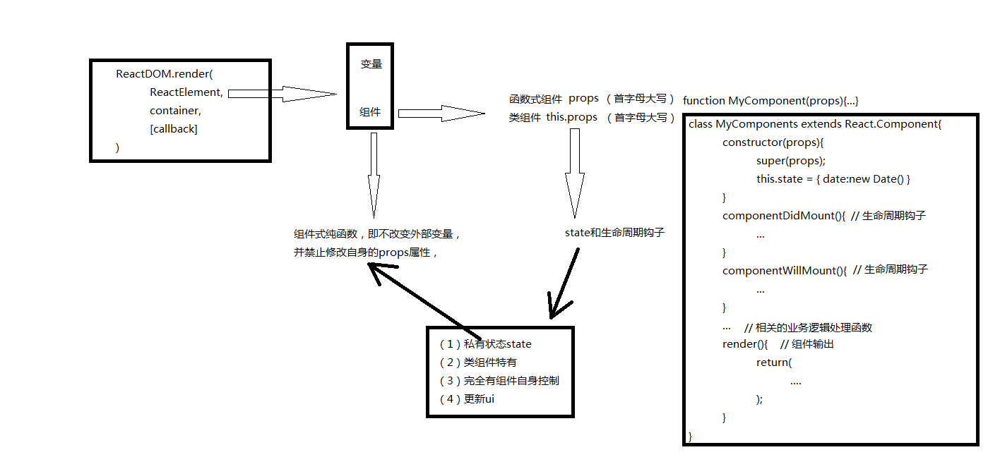

## [状态（state）和生命周期](http://www.css88.com/react/docs/state-and-lifecycle.html)

### 状态state

state 类组件特有的，完全由组件自身控制，函数式组件是没有state的，但是有props属性

目前我们知道的更新ui的方法只有一种，调 ReactDOM.render() 方法来更新渲染的输出：

	function tick() {
	  const element = (
	    

	      <h1>Hello, world!</h1>
	      <h2>It is {new Date().toLocaleTimeString()}.</h2>
	    

	  );
	  ReactDOM.render(
	    element,
	    document.getElementById('root')
	  );
	}
	
	setInterval(tick, 1000);

现在提供一种更合理的方法：state，它完全由类组件自身控制，是一种局部状态,state 和 props 类似，但是它是私有的，并且由组件本身完全控制。

### 把函数式组件转化为类组件

	定时器，函数：
	
	function tick() {
	  const element = (
	    

	      <h1>Hello, world!</h1>
	      <h2>It is {new Date().toLocaleTimeString()}.</h2>
	    

	  );
	  ReactDOM.render(
	    element,
	    document.getElementById('root')
	  );
	}
	
	setInterval(tick, 1000); //	每隔1s调用一次tick函数

	-------------------------------------------------------

	定时器，函数组件：

	function Clock(props) { //	定义函数组件，并传入属性props
	  return (
	    

	      <h1>Hello, world!</h1>
	      <h2>It is {props.date.toLocaleTimeString()}.</h2>
	    

	  );
	}
	
	function tick() {
	  ReactDOM.render(
	    <Clock date={new Date()} />, //	函数组件Clock，并传入date属性
	    document.getElementById('root')
	  );
	}
	
	setInterval(tick, 1000); //	每隔1s调用一次tick函数

	-------------------------------------------------------

	定时器函数转化为类组件（还未添加state和生命周期钩子）：
	
	class Clock extends React.Component {
	  render() {
	    return (
	      

	        <h1>Hello, world!</h1>
	        <h2>It is {this.props.date.toLocaleTimeString()}.</h2>
	      

	    );
	  }
	}

> 转化的步骤：
> 
> 1. 创建一个继承自 React.Component 类的 ES6 class 同名类（ ES5 使用React.createClass{ render:function(){...} } ）。
> 
> 2. 添加一个名为 render() 的空方法。
> 
> 3. 把原函数中的所有内容移至 render() 中。
> 
> 4. 在 render() 方法中使用 this.props 替代 props。
> 
> 5. 删除保留的空函数声明。
> 
>说明：
>
>类允许我们在其中添加本地状态(state)和生命周期钩子。 

### 在类组件中添加本地状态(state)

把date从属性(props) 改为 状态(state)分三步：

1）替换 render() 方法中的 this.props.date 为 this.state.date

2）添加一个 类构造函数(class constructor) 初始化 this.state

3） 移除 <Clock /> 元素中的 date 属性
	
	初始化state，并没有开始计时：
	class Clock extends React.Component {

	//	构造函数
	  constructor(props) {
	    super(props);
	    this.state = {date: new Date()};	//	初始化state的值
	  }
	
	//	组件输出
	  render() {
	    return (
	      

	        <h1>Hello, world!</h1>
	        <h2>It is {this.state.date.toLocaleTimeString()}.</h2>
	      

	    );
	  }
	}
	
	//	渲染
	ReactDOM.render(
	  <Clock />,
	  document.getElementById('root')
	);

### 在类中添加生命周期方法

挂载：mounting（第一次渲染到DOM之后）

卸载：unmounting（DOM 被销毁时）

当组件挂载和卸载时，我们可以在组件类上声明特殊的方法，称之为生命周期钩子，如componentDidMount() {}，componentWillUnmount() {}；componentDidMount在组件输出被渲染到 DOM 之后运行，

使用 this.setState() 来来周期性地更新组件本地状态

	class Clock extends React.Component {

	//	构造函数
	  constructor(props) {
	    super(props);
	    this.state = {date: new Date()};// 唯一可以分配 this.state 的地方
	  }
	
	// 组件输出被渲染到DOM之后
	  componentDidMount() {
	    this.timerID = setInterval(  // setInterval(function(){ return this.tick() },1000)
	      () => this.tick(),
	      1000
	    );
	  }

	// 组件被卸载时清空计时器
	  componentWillUnmount() {
	    clearInterval(this.timerID);
	  }

	//	这个函数用来设置state，this.setState（ {...} ）
	  tick() {
	    this.setState({
	      date: new Date()
	    });
	  }
	
	//	组件输出
	  render() {
	    return (
	      

	        <h1>Hello, world!</h1>
	        <h2>It is {this.state.date.toLocaleTimeString()}.</h2>
	      

	    );
	  }
	}
	
	ReactDOM.render(
	  <Clock />,
	  document.getElementById('root')
	);

### 正确地使用 State(状态)

1. 不要直接修改 state(状态)，this.state.comment = 'Hello';这样修改不会重新渲染组件
2.  setState() ，setState({comment:'hello'})
3.  唯一可以分配 this.state 的地方是构造函数。

### state(状态) 更新可能是异步的

React 为了优化性能，有可能会将多个 setState({}) 调用合并为一次更新。

问题：因为 this.props 和 this.state 可能是异步更新的，所以不能依赖他们的值计算下一个state(状态)。

	// 错误
	this.setState({
	  counter: this.state.counter + this.props.increment,
	});

解决：setState(fn) ，它接收一个函数，而不是一个对象。该函数接收前一个状态值作为第 1 个参数， 并将更新后的值作为第 2个参数，
或者，这个函数将接收前一个状态作为第一个参数，应用更新时的 props 作为第二个参数
	
	//ES6箭头函数
	this.setState((prevState, props) => ({
	 	 counter: prevState.counter + props.increment
		})
	);

	//ES5
	this.setState(function(prevState, props) {
	  return {
	    counter: prevState.counter + props.increment
	  };
	});

### state(状态)更新会被合并

## 组件的生命周期

组件的生命周期分成三个状态：

+ mounting：已插入真实 DOM

+ updating：正在被重新渲染

+ unmounting：已移出真实 DOM

React 为每个状态都提供了两种处理函数，`will`: 函数在进入状态之前调用，`did`: 函数在进入状态之后调用，三种状态共计五种处理函数（生命周期钩子）。

+ componentWillMount()：组件挂载到DOM之前

+ componentDidMount()：组件挂载到DOM之后

+ componentWillUpdate(object nextProps, object nextState)：组件更新前

+ componentDidUpdate(object prevProps, object prevState)：组件更新后

+ componentWillUnmount()：组件卸载之前

此外，React 还提供两种特殊状态的处理函数:

+ componentWillReceiveProps(object nextProps)：已加载组件收到新的参数时调用
 
+ shouldComponentUpdate(object nextProps, object nextState)：组件判断是否重新渲染时调用

		//	ES5
	    

> 说明
> 
> 上面代码在hello组件加载以后，通过 componentDidMount 方法设置一个定时器，每隔100毫秒，就重新设置组件的透明度，从而引发重新渲染。
> 
> 另外，组件的style属性的设置方式也值得注意，不能写成 style="opacity:{this.state.opacity};",而是写成style={{opacity: this.state.opacity}}，这是因  为 [React 组件样式](https://facebook.github.io/react/docs/dom-elements.html)是一个对象，所以第一重大括号表示这是 JavaScript 语法，第二重大括号表示样式对象。

当你调用 setState()， React 将合并你提供的对象到当前的状态中。